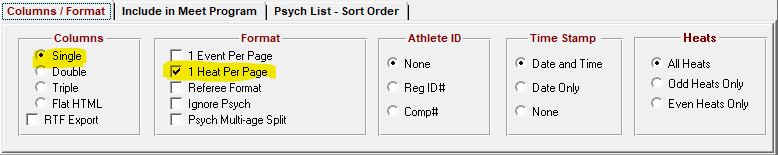
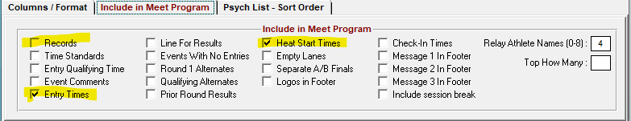
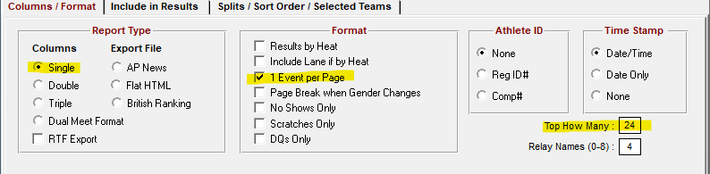
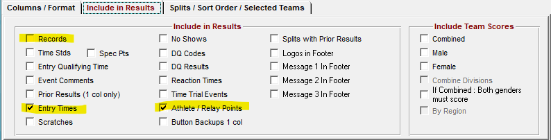
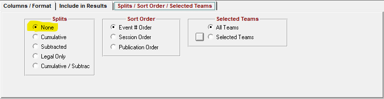
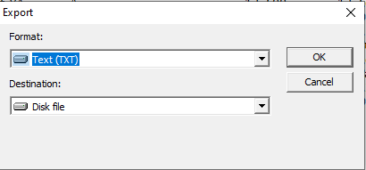

# Generate meet files for Wirecast

This program will take a Meet Manager generated MeetProgram or a Results file, saved as a text file, and reformat that text file for optimal display in wirecast.

## How to Run
```
python/generate_wirecast_files.py -f dec-results.txt
python/generate_wirecast_files.py -h
```

Command Line Parameters

```
optional arguments:
  -i INPUTDIR, --inputdir INPUTDIR
                        input directory for MM extract report
  -f FILENAME, --filename FILENAME
                        Input file name
  -o OUTPUTDIR, --outputdir OUTPUTDIR
                        root output directory for wirecast heat files.
  -c, --crawler         Generate crawler files
  -r, --shortschrelay   Use Short School names for Relays
  -l, --longschind      Use Long School names for Indiviual Entries
  -d, --delete          Delete existing files in OUTPUT_DIR
  -n NUMRESULTS, --numresults NUMRESULTS
                        Number of results listed per event
  -x LASTNUMEVENTS, --lastnumevents LASTNUMEVENTS
                        Crawler outputs a separate file with the last N events
  -e, --emptyresults    Generate empty results files for wirecast template setup
  -F {1,2}, --relayformat {1,2}
                        1 -- Default relay heat program. 2 -- team/name on same line
  -S, --splitrelays     Split Relays into multiple files
  -R, --displayRelayNames
                        Display relay swimmer names, not just the team name in results
  -N, --namesfirstlast  Swap Non Relay names to First Last from Last, First
  -T {auto,program,results,headers}, --reporttype {auto,program,results,headers}
                        Program type, Meet Program or Meet Results
  -v {error,warning,info,debug}, --log {error,warning,info,debug}
                        Set debugging level2
  -q, --quote           Quote the output fields for DEBUGGING
  -h, --help            Tested with MM 8
```

## Format Reports
The report needs very specific formatting options for this program to work.

## Meet Program





## Results

Its best to create a memorized report for results as you will have to run it after every event.



* Column: Single
* 1 Event Per Page
* Top How Many 24 (results must fit on single page)



* DeSelect
    * results
* Include
    * Entry Times
    * Athlete / Relay Points


* Splits: None


## Save Report



Save as Text to the default input file directory for the generate script. 

Default directory: 
```C:\Users\SetonSwimTeam\mmreports```


## Example commands

Meet Program

```
python/generate_wirecast_files.py -o /c/Users/SetonSwimTeam/Dropbox/wirecast -i /c/Users/SetonSwimTeam/Dropbox/wc_meetreports -f 20211122_setontimetrails_program.txt  -m SetonTimeTrials
```

 python/generate_wirecast_files.py -o /c/Users/SetonSwimTeam/Dropbox/wirecast -i /c/Users/SetonSwimTeam/Dropbox/wc_meetreports -f 20211122_setontimetrails_results.txt  -m SetonTimeTrials

python/generate_wirecast_files.py -m HighSchool -o /c/Users/SetonSwimTeam/Dropbox/wirecast -i /c/Users/SetonSwimTeam/Dropbox/wc_meetreports -f 2021-setonwinterinvite-program.txt 

python/generate_wirecast_files.py -m HighSchool -o /c/Users/SetonSwimTeam/Dropbox/wirecast -i /c/Users/SetonSwimTeam/Dropbox/wc_meetreports -f 2021-setonwinterinvite-results.txt 

python/generate_wirecast_files.py -m HighSchool -o /c/Users/SetonSwimTeam/Dropbox/wirecast -i /c/Users/SetonSwimTeam/Dropbox/wc_meetreports -f 2021-setonwinterinvite-score.txt 

# TODO:

* eventtypes: can we determine events by name (i.e. look for relay or diving)